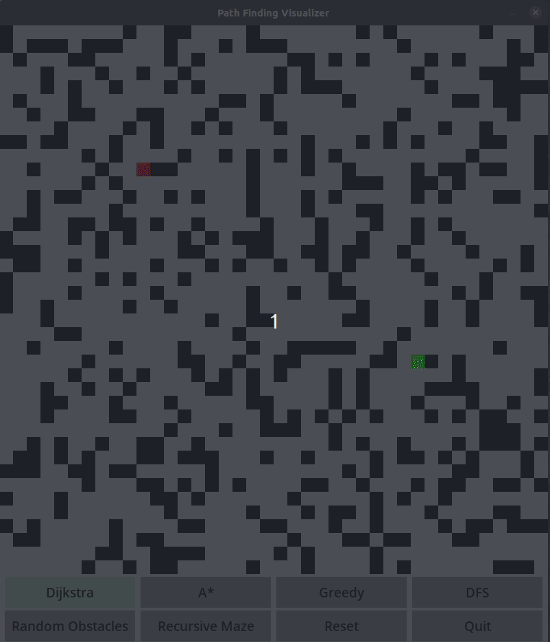
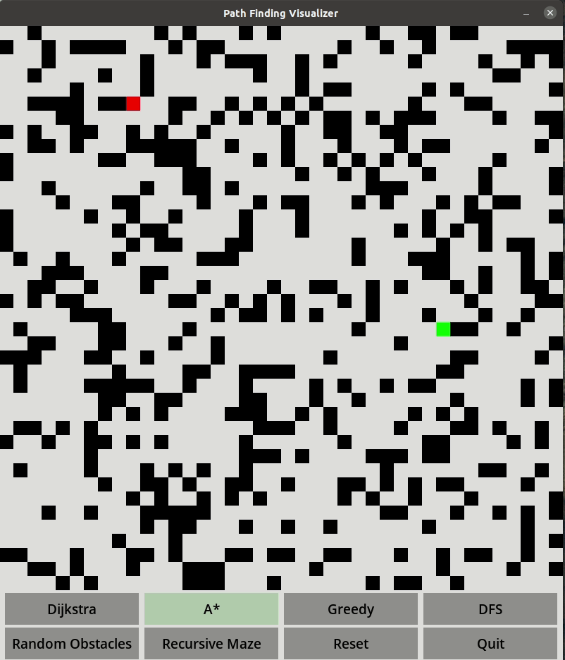
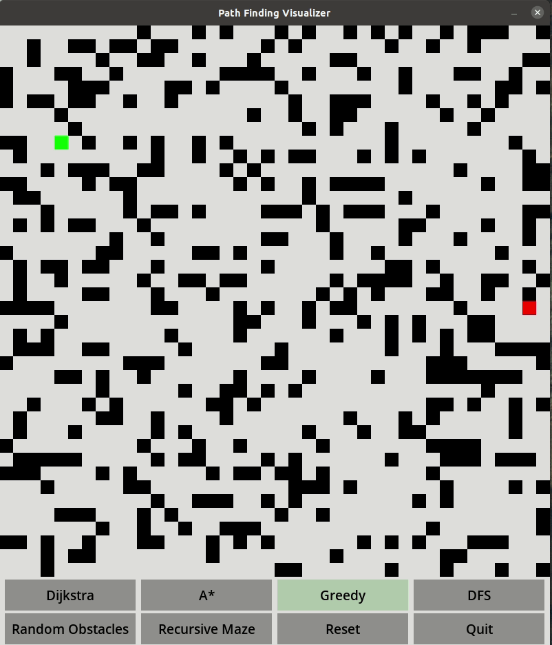
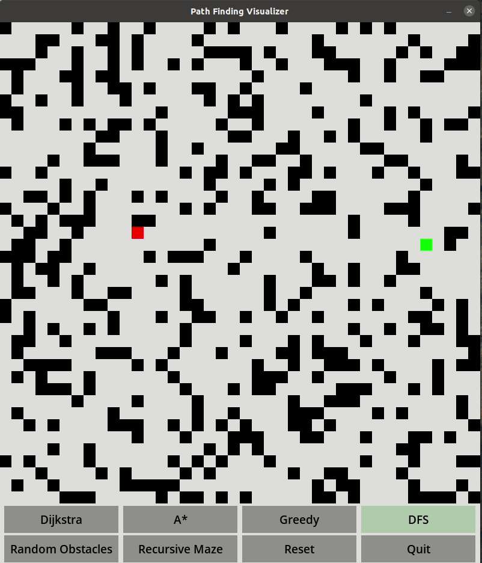
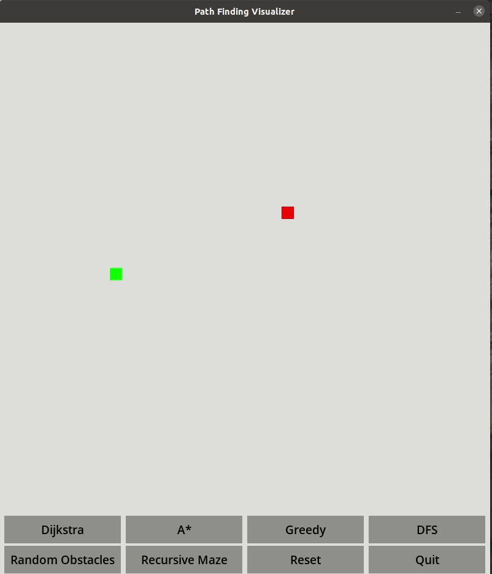
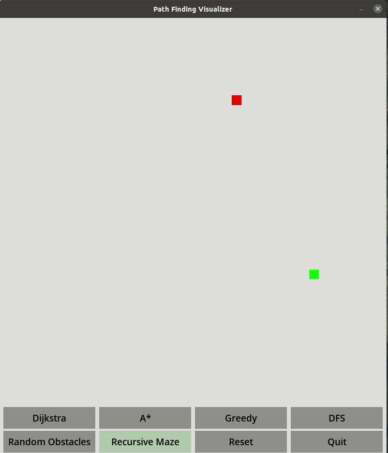

# Learning About Pathfinding Algorithms

This was a fun project I created that showcases four different pathfinding algorithms. It was written in Python 3.8.5 and I used Pygame 2.0.

## Installation

1. First make sure you have Python 3 installed: https://www.python.org/downloads/ <br />

1. After that is installed, you'll need to download Pygame. That can be done by the running following command

    ```
    python3 -m pip install -U pygame --user
    ```

    NOTE: Linux users can install Pygame by typing the command in the terminal

    ```
    sudo apt-get install python3-pygame
    ```

1. To run the program
    ```
    python3 main.py
    ```

## Features

Four algorithms (Dijkstra, A*, Greedy and Depth-first search) are explored and visualized. <br />

* Dijkstra <br />
    

* A* <br />
    

* Greedy <br />
    

* Depth-first Search <br />
    
<br /> <br />

Obstacles on the board can be generated randomly or by right clicking and dragging. There is also an option to generate a maze via recursive division. <br />

* Randomly Generate Obstacles <br />
    

* Recursive Division <br />
    

## Sources

* [Minheap Priority Queue](https://bradfieldcs.com/algos/trees/priority-queues-with-binary-heaps/)
* [Wikipedia - Pathfinding](https://en.wikipedia.org/wiki/Pathfinding)
